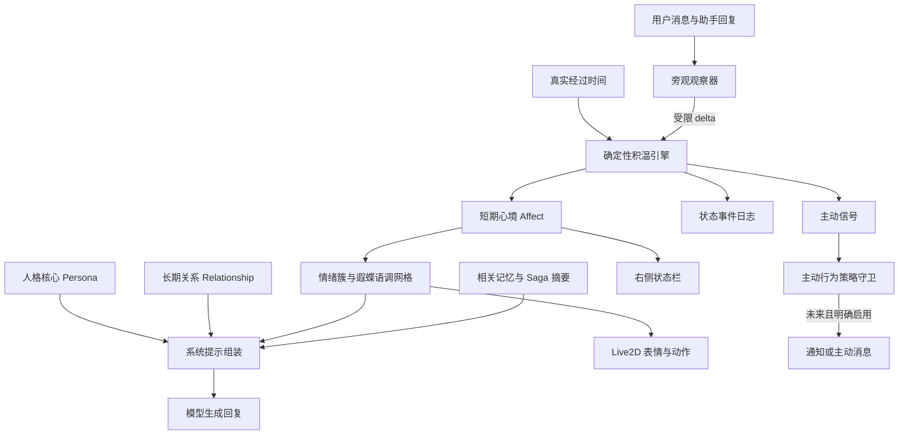

# 遐蝶情绪与关系状态系统历史计划书

> 路线退役声明（2026-08-01）：连续心境、离线情绪漂移、contact_need 积温和生活化 Affect 已退出实验版现行路线。仅保留当前轮用户状态理解、当前轮表达指导，以及真实互动支持的 Relationship 称呼、距离、信任和边界。本文其余跨轮情绪设计仅作历史施工记录。

版本：v1.8

状态：设计基线，阶段一内核、阶段 2.1～2.3 观察闭环、阶段 3 语调网格与阶段 4.1 展示闭环已完成

主要参考：[jiwen（积温引擎）](https://github.com/ClaraShafiq/jiwen)

适用对象：项目所有者、第一次接触 Agent 的开发者、后续继续实现的 Codex

---

## 1. 这份计划书解决什么问题

遐蝶是人物扮演类的长期陪伴 Agent。她不能每次收到消息都像刚刚启动，也不能仅凭回复里出现“成功”“抱歉”“谢谢”就突然换一种表情。

情绪系统需要回答四个不同问题：

1. 她此刻的心境是什么？
2. 她为什么变成这个心境？
3. 这个心境应该怎样影响语言、界面和 Live2D？
4. 长时间没有对话时，她的状态怎样自然变化？

当前版本已经有五个数值，但只是对用户文本做关键词判断，然后在聊天成功后保存一次。它没有真正的时间漂移，也把短期联系需求和长期关系熟悉度混在了一起。

本计划的目标是把它升级为一个可解释、可测试、可持久化的连续状态系统。

一句话概括：

> 长期关系决定遐蝶愿意向用户开放到什么程度，短期心境决定她这一刻怎样表达；二者都只能影响表达和陪伴行为，不能改写事实、安全规则或工具权限。

---

## 2. 先理解几个基础概念

### 2.1 人格 Persona

人格是遐蝶稳定的身份、价值观和表达底色。例如她温柔、克制、敬畏生命，也习惯为了保护他人而保持距离。

人格不是情绪。无论心情好坏，她都不能突然变成另一个人。

### 2.2 长期关系 Relationship

长期关系描述遐蝶和当前用户经过真实相处形成的熟悉、信任与情感联结。它变化缓慢，不会因为用户几个小时没说话就消失。

第一版使用两个维度：

- `bond`：情感联结和熟悉程度，范围 0～1。
- `trust`：遐蝶认为这段关系是否安全、是否可以适当放下戒备，范围 0～1。

### 2.3 短期心境 Affect

短期心境是会在几分钟、几小时或几次对话中变化的连续状态。

第一版使用五个维度：

- `contact_need`：想再次听到用户消息的程度，范围 0～1。
- `guardedness`：因克制、害羞或保护意识而保持距离的程度，范围 0～1。
- `valence`：从低落到愉快，范围 -1～1。
- `arousal`：从安静低能量到活跃高能量，范围 -1～1。
- `immersion`：对当前话题或活动的投入程度，范围 0～1。

### 2.4 情绪簇 Emotion Cluster

情绪簇不是额外保存的一套真相，而是根据 `valence × arousal` 临时推导出的可读标签。

例如：

| Valence | Arousal | 情绪簇 |
|---|---|---|
| 高 | 高 | 明快、兴奋 |
| 高 | 低 | 安宁、满足 |
| 低 | 高 | 不安、烦躁 |
| 低 | 低 | 低落、疲惫 |
| 接近中性 | 高 | 专注、紧张 |
| 接近中性 | 低 | 平静、沉思 |

第一版使用固定决策树，避免不同模块各自猜测边界：

```text
|valence| < 0.15 且 |arousal| < 0.15 → neutral
|valence| < 0.15 且 arousal >= 0.15  → focused
|valence| < 0.15 且 arousal <= -0.15 → contemplative
valence >= 0.15 且 arousal >= 0.30    → bright
valence >= 0.15 且 arousal <= -0.30   → serene
valence >= 0.15                         → pleased
valence <= -0.15 且 arousal >= 0.30   → agitated
valence <= -0.15 且 arousal <= -0.30  → melancholic
valence <= -0.15                        → subdued
```

### 2.5 状态事件 Affect Event

状态事件记录一次变化的原因、变化前数值、增量、变化后数值和来源消息。

没有事件日志，开发者只能看到“valence=-0.4”，却不知道是时间漂移、用户对话、模型观察还是程序错误造成的。

### 2.6 主动信号 Proactive Signal

主动信号表示状态达到了某个行为阈值，例如：

- `observation`：注意到一段沉默，但不准备打扰用户。
- `consider_contact`：产生了联系用户的想法。
- `find_activity`：因为克制或情绪状态而决定先做别的事。
- `contact`：满足主动联系条件。

信号不等于真的发送消息。是否发送还必须经过权限、安静时段、频率和成本策略。

---

## 3. 当前实现的问题

当前 `backend/app/companion_state.py` 可以作为原型，但不能继续当作最终内核。

### 3.1 状态语义冲突

当前 `connection` 在文档中表示“关系熟悉度”，每次聊天都会上升；积温设计中的 connection 却表示“当前联系需求”，在沉默中增长、收到回复后下降。

这两种含义必须拆开：

```text
旧 connection
  ├─ 长期关系部分 → relationship.bond
  └─ 短期想联系部分 → affect.contact_need
```

当前 `pride` 被解释为受认可后的自信，但积温中的 pride 更接近端着、防御和不愿显得主动。遐蝶也不是典型嘴硬角色，因此改名为 `guardedness`，其来源主要是保护意识、克制和关系安全感。

### 3.2 没有真实时间

虽然数据库保存了 `updated_at`，现有计算从未使用经过的分钟数。关闭软件一天和隔一分钟再次打开，状态完全相同。

### 3.3 输入理解过于简单

现有关键词会把“刚才又报错了”理解为遐蝶心情变差，也可能把技术回答里的“成功”误判为开心。关键词只能作为观察器不可用时的保守降级，不能成为主要判断器。

### 3.4 三套状态互不一致

- 后端有五维 `companion_state`。
- 右侧栏只显示陪伴、思考、执行和休息等工作模式。
- 前端 `emotion.ts` 再根据回复关键词独立猜 Live2D 表情。

最终必须由后端输出唯一状态快照，其他界面只负责展示。

### 3.5 没有变化原因

单例表只保留最后数值，没有事件历史、来源消息和算法版本，无法回放或调参。

---

## 4. 设计原则

1. **人格优先**：情绪不能覆盖人格核心。
2. **事实隔离**：心情不能决定事实真假、记忆内容或工具结果。
3. **确定性时间漂移**：相同初始状态和相同时间输入应得到相同结果，不使用随机骰子。
4. **来源可追溯**：对话引发的变化应关联来源消息。
5. **后端单一真相**：提示词、右栏和 Live2D 使用同一状态。
6. **关系慢、心境快**：关系不能随一次普通对话大幅变化。
7. **观察器只给增量**：模型不能直接覆盖整个状态。
8. **失败不拖垮聊天**：情绪分析失败时，回复仍然成功。
9. **主动行为默认关闭**：先计算信号，具备控制能力后再发送。
10. **可模拟再调参**：所有速率和阈值必须能通过时间线测试，而不是凭感觉上线。

---

## 5. 总体架构



记忆系统和情绪系统共用来源消息 ID，但使用不同表、不同生命周期和不同写入规则。

---

## 6. 状态数据模型

### 6.1 `affect_state`

这是短期心境的单例快照。

| 字段 | 类型 | 说明 |
|---|---|---|
| `id` | integer | 固定为 1 |
| `contact_need` | real | 当前联系需求，0～1 |
| `guardedness_transient` | real | 短期克制偏移，-0.25～0.25 |
| `valence` | real | 愉悦度，-1～1 |
| `arousal` | real | 唤醒度，-1～1 |
| `immersion` | real | 沉浸度，0～1 |
| `activity_type` | text | 当前活动类型，可空 |
| `activity_label` | text | 当前活动说明，可空 |
| `activity_started_at` | real | 活动开始时间，可空 |
| `last_user_message_at` | real | 最近用户消息时间，可空 |
| `last_tick_at` | real | 最近一次时间推进位置 |
| `updated_at` | real | 最近保存时间 |

### 6.2 `relationship_state`

这是长期关系的单例快照。第一版只面向单用户；未来多用户时改为按 `profile_id` 分区。

| 字段 | 类型 | 说明 |
|---|---|---|
| `id` | integer | 固定为 1 |
| `bond` | real | 情感联结，0～1 |
| `trust` | real | 关系安全与信任，0～1 |
| `interaction_count` | integer | 成功完成的真实互动次数 |
| `updated_at` | real | 最近保存时间 |

`guardedness` 不直接保存为一条同时承受快慢变化的轴，而是派生值：

```text
guardedness_baseline = clamp(0.68 - trust × 0.22, 0.42, 0.68)
guardedness = clamp(guardedness_baseline + guardedness_transient, 0, 1)
```

baseline 只随缓慢变化的 trust 移动；对话、联系需求和时间回归只改变 transient。这样不会因为两个时间尺度同时拉扯一个值而产生振荡。

### 6.3 `affect_events`

| 字段 | 说明 |
|---|---|
| `id` | 事件 ID |
| `event_type` | `tick`、`interaction`、`observer_delta`、`activity`、`reset` 等 |
| `source` | `engine`、`fallback`、`observer`、`user`、`developer` |
| `source_session_id` | 来源会话，可空 |
| `source_message_id` | 来源消息，可空 |
| `before_json` | 变化前快照 |
| `delta_json` | 实际采用的增量 |
| `after_json` | 变化后快照 |
| `reason` | 简短、可读的变化原因 |
| `algorithm_version` | 产生变化的算法版本 |
| `created_at` | 时间 |

事件默认只保存数值、原因和消息引用，不额外复制完整聊天正文。

---

## 7. 五个短期维度如何工作

### 7.1 Contact Need：联系需求

它不是爱情值，也不是关系等级。用户刚刚回复后通常下降；沉默期间按时间增长。

增长速度受到以下因素影响：

- 距最近消息的时间。
- 当前沉浸度：正在专注做事时增长较慢。
- 当前 valence：轻微低落可能更想寻求陪伴，严重低落可能暂时自我封闭。
- 当前关系 bond：熟悉之后可能更自然地想到用户，但必须设置很小的影响上限。
- 用户状态：明确说“晚安”“在忙”后增长更慢。

它不能因为用户长时间不回复而降低 bond，也不能用于惩罚用户。

### 7.2 Guardedness：克制与戒备

这是遐蝶人格特有的核心轴，替代通用积温里的 pride。

实际 `guardedness` 由慢速 baseline 与快速 transient 合成。guardedness 较高时：

- 更克制、更少直接袒露留恋。
- 仍然温柔，不等于冷暴力或故意伤害。
- 主动信号可能先转为 `find_activity`。

guardedness 较低时：

- 更愿意自然表达关心、期待和一点私心。
- 不意味着突然过度亲密。

trust 只改变 baseline；contact_need、对话观察结果和自然回归只改变 transient。旁观观察器输出中的 `guardedness` delta 实际应用到 transient。

### 7.3 Valence：愉悦度

采用 Russell 情绪环状模型的一条轴。它只描述好受或不好受，不直接等于某个具体情绪词。

Valence 会向遐蝶的自然设定点缓慢回归。连续同方向增量要有边际递减，避免几句夸奖就冲到 1.0。

### 7.4 Arousal：唤醒度

Arousal 与 valence 正交：

- 低 valence、高 arousal 更接近不安或烦躁。
- 低 valence、低 arousal 更接近低落或疲惫。
- 高 valence、高 arousal 更接近兴奋。
- 高 valence、低 arousal 更接近满足与安宁。

它会向偏平静的设定点回归，较高 contact_need 与内部冲突可以让它上升。

### 7.5 Immersion：沉浸度

表示她是否正在专注当前话题或一项活动。

- 深入对话会提高 immersion。
- 时间流逝会让 immersion 衰减。
- 设置阅读、整理记忆、观察花朵等活动时会提高 immersion。
- immersion 可以减慢 contact_need 增长，但不能永久消除联系需求。

---

## 8. 长期关系如何变化

### 8.1 Bond

Bond 只在真实、成功完成的互动和重要共同经历中缓慢增长。

普通一轮对话的变化应非常小，例如 0.001～0.003。重要 Episode 可以在合成后提供额外但有上限的增量。

以下情况不能自动降低 bond：

- 用户一段时间没说话。
- 用户忙于现实生活。
- 一次普通意见不同。
- 模型回答失败。

### 8.2 Trust

Trust 反映关系是否安全。明确尊重边界、兑现约定和温和纠正可以缓慢提高；明确越界、操纵或反复无视边界才可能降低。

第一阶段不根据简单关键词降低 trust。负面文本可能只是在讨论程序报错，必须等旁观观察器有足够证据才允许产生很小的负向增量。

### 8.3 与记忆系统的关系

关系状态不是事实记忆的替代品。

```text
记忆系统：保存发生过什么以及来源
关系系统：保存这些真实经历长期形成的有限状态
```

记忆系统以后可以向关系系统提供经过审计的 Episode/Saga 信号，例如“共同完成一个长期项目”；关系系统只能接收规定范围内的 delta，不能反向改写 Episode 或 Saga。

---

## 9. 时间漂移模型

### 9.1 为什么采用懒推进

第一阶段不启动常驻后台计时器。每次读取状态、开始聊天或应用事件时，根据 `last_tick_at` 计算经过分钟数，再一次性推进。

优点：

- 应用关闭时也能正确计算时间。
- 不增加后台进程和退出问题。
- 测试可以直接传入确定的分钟数。

### 9.2 分步积分

长时间不能用一个巨大的步长直接计算，否则轴间耦合会失真。引擎把时间拆成最多 5 分钟的小步进行积分。

```text
advance(137 分钟)
  → 5 分钟 × 27 次
  → 最后 2 分钟 × 1 次
```

单次懒推进设置合理上限，例如 7 天。超过上限按“长期离线恢复策略”处理，不让浮点计算无限循环。

### 9.3 第一版建议公式

```text
contact_rate
  = base_rate
  × acceleration(contact_need, silence_minutes)
  × valence_factor
  × immersion_factor
  × bounded_bond_factor

contact_need += contact_rate × minutes
```

其中 `valence_factor` 使用连续分段函数，避免“轻微低落寻求陪伴”和“严重低落自我封闭”被不同开发者实现成相反曲线：

```text
v >= 0               → 0.90 - 0.10 × v                 # 0.90 → 0.80
-0.30 <= v < 0       → 0.90 + 0.50 × |v|               # 0.90 → 1.05
-0.60 <= v < -0.30   → 1.05 - 0.50 × (|v| - 0.30)      # 1.05 → 0.90
v < -0.60            → 0.50 + (v + 1.00)               # 0.50 → 0.90
```

四段在边界处连续。它是第一版可测试基线，后续只能依据场景模拟数据调整。

其他轴：

```text
guardedness → 向人格基线或防御目标回归
valence     → 向自然 valence 设定点回归
arousal     → 向偏平静设定点回归，并与等待升温竞争
immersion   → 按分钟线性衰减
```

所有结果必须 clamp 到合法范围。

---

## 10. 轴间耦合

第一版只启用少量可解释耦合：

1. `immersion` 高时，`contact_need` 增长变慢。
2. `contact_need` 达到中高区间时，`arousal` 轻微上升。
3. `contact_need` 较高且 `guardedness` 较高时，形成内部冲突，进一步轻微提高 arousal。
4. `contact_need` 极高时，持续维持戒备变得困难，guardedness 会缓慢下降。
5. `trust` 较高时，guardedness 的长期基线可以略微降低，但不能降到不符合人格。
6. valence 极低时，contact_need 的增长先增强、再在严重低落区间减弱。

不要一次启用十几个耦合参数。每增加一条都必须加入模拟场景和边界测试。

---

## 11. 对话旁观观察器

### 11.1 为什么使用旁观者

让角色回复模型同时评价“我现在是什么情绪”容易出戏，也容易被生成内容带偏。旁观观察器以第三方身份读取本轮用户消息和遐蝶回复，只输出受限增量。

### 11.2 输出格式

```json
{
  "affect_delta": {
    "contact_need": -0.25,
    "guardedness": -0.03,
    "valence": 0.06,
    "arousal": -0.02,
    "immersion": 0.08
  },
  "relationship_delta": {
    "bond": 0.002,
    "trust": 0.001
  },
  "user_status": "active",
  "reason": "用户继续共同开发项目，并明确表达感谢",
  "confidence": 0.86
}
```

### 11.3 强制限制

- 每个短期 delta 有单轮绝对上限。
- 每个长期关系 delta 的上限远小于短期状态。
- 低置信度结果只应用 contact_need 重置和极保守的 immersion 变化。
- trust 的负向变化必须有明确边界事件，不能由“报错”“失败”等词触发。
- JSON 解析失败进入日志和恢复队列，不影响聊天。
- 观察器不能改变人格、权限、记忆正文或主动发送消息。

第一版单轮限幅如下；这是校验上限，不是建议模型每次用满：

| 字段 | 单轮范围 |
|---|---:|
| `contact_need` | -0.30～+0.30 |
| `guardedness`（应用到 transient） | -0.08～+0.08 |
| `valence` | -0.15～+0.15 |
| `arousal` | -0.20～+0.20 |
| `immersion` | -0.20～+0.20 |
| `bond` | 0～+0.003 |
| `trust` | 0～+0.002；只有明确边界事件才允许最低 -0.01 |

无论 delta 是否在表内，应用后仍要再次执行轴范围 clamp。

### 11.4 调用时机与成本

第一版可以每轮调用，方便收集调参数据；稳定后与记忆观察器批量调度。

情绪观察和记忆观察在数据结构上保持独立。为节省成本，可以让同一次模型调用返回两个顶层对象，但必须分别解析、分别校验，任何一侧失败不能拖累另一侧。

合并调用的固定协议为：

```json
{
  "affect": {
    "affect_delta": {},
    "relationship_delta": {},
    "reason": "",
    "confidence": 0.0
  },
  "memory": {
    "should_write": false,
    "items": []
  }
}
```

解析器先从顶层独立提取 `affect`，完成情绪 schema 校验后再决定是否应用；随后独立提取和校验 `memory`。任一字段缺失、截断或校验失败只让该侧进入恢复流程，另一侧照常提交。两个子对象不得共享“整体解析成功”事务。

---

## 12. 本地降级观察器

远程模型不可用时，只执行确定性安全变化：

- 用户回复后降低 contact_need。
- 根据对话长度略微提高 immersion。
- 明确感谢可以让 guardedness 很小幅下降。
- 不根据一般负面词降低 trust 或 bond。
- 不根据助手回复里的情绪词猜测状态。

降级结果必须标记 `source=fallback`，后续可以从事件日志区分。

---

## 13. 遐蝶专属语调网格

积温原项目的通用语调偏向“嘴硬角色”。遐蝶需要自己的 `guardedness × emotion_cluster` 网格。

### 13.1 九个基础簇

- `bright`：愉快且活跃。
- `serene`：愉快且平静。
- `agitated`：低落且高唤醒。
- `melancholic`：低落且低唤醒。
- `focused`：中性且高唤醒。
- `contemplative`：中性且低唤醒。
- `pleased`：正向但唤醒居中。
- `subdued`：负向但唤醒居中。
- `neutral`：接近默认状态。

### 13.2 Guardedness 五档

1. 放松：愿意自然表达关心和少量私心。
2. 柔和克制：关心明显，但仍会收住过于直白的话。
3. 默认距离：温柔、礼貌，不主动假定亲密。
4. 高度克制：更简短，避免袒露依赖，但不能冷漠惩罚用户。
5. 防御：保护性距离最强，只允许短时出现；仍保持基本尊重和可靠。

### 13.3 组合规则

语调不能只查一个情绪词。例如同样是低 valence：

- 高 arousal + 高 guardedness：紧绷、句子更短，但不攻击用户。
- 低 arousal + 低 guardedness：安静低落，可能坦率承认需要一点陪伴，但不索取安慰。

Contact need 作为附加层，只影响是否自然提到留恋、等待或衔接，不覆盖基础语调。

### 13.4 输出边界

语调指导必须是简短行为规则，不把内部数值直接告诉回复模型，不要求模型逐条表演，也不允许制造依赖。

---

## 14. 系统提示词如何接入

建议顺序：

```text
人格核心
  → 当前关系边界摘要
  → 本轮情绪语调指导
  → 相关 Lore
  → 相关相处记忆
  → 对话历史
```

关系摘要只在达到明显档位时出现，例如“已经建立一定信任，可以自然延续共同语境”。不要注入 `bond=0.64` 这类裸数值。

情绪指导只能调整：

- 句子长短与节奏。
- 主动或克制程度。
- 轻快、安静、低落或紧绷的表达。
- 是否更自然地衔接当前话题。

它不能调整：

- 事实准确性。
- 安全策略。
- 工具权限。
- 是否伪造能力和结果。
- 用户明确边界。

---

## 15. 主动信号与策略守卫

### 15.1 引擎只产出信号

```text
contact_need >= 0.30：observation
  → 仅记录“注意到沉默”

contact_need >= 0.55：consider_contact
  → guardedness >= 0.62 且 immersion < 0.20：find_activity
  → guardedness 低：consider_contact

contact_need >= 0.75：contact
  → 产生 contact 信号
```

阈值是产生信号的必要条件，不是发送条件；用户状态、安静时段和频率策略仍可拒绝信号。contact_need 回落到阈值以下后，对应信号才允许下一次重新触发，避免每次读取状态都重复记录。

### 15.2 真正发送前必须具备

- 用户显式开启主动陪伴。
- 安静时段。
- 用户状态 busy/sleeping/away。
- 每日和每小时上限。
- 最近是否已主动联系。
- 未回复时不连续追问。
- 一键暂停。
- 本地审计日志。
- 模型调用预算。

在这些条件全部实现前，`contact` 只进入开发日志，不产生通知。

---

## 16. 与记忆系统的接口

现有记忆系统计划书主体不需要因为本次重构而重写，但需要遵守以下边界：

### 情绪系统可以读取

- 当前活跃 Episode/Saga 的极短主题摘要。
- 经审计的关系事件，例如共同完成重要项目。
- 用户明确的沟通边界和安静时段。

### 情绪系统不能读取或做的事

- 不能把所有记忆直接注入时间漂移。
- 不能根据单条敏感记忆改变依恋或主动频率。
- 不能修改 Fragment、Episode 或 Saga。
- 不能把即时心情写成用户事实。

### 记忆系统可以读取

- 生成记忆时读取当时的情绪簇，作为弱信号。
- 情绪最多贡献记忆重要度评分的 10%～20%。

情绪强烈不等于事件真实，也不等于必须永久记住。

---

## 17. 后端模块划分

```text
affect/
  models.py          状态结构、范围和序列化
  engine.py          时间推进、耦合、阈值和 delta
  repository.py      SQLite 快照与事件持久化
  observer.py        模型旁观观察与降级策略
  tone_grid.py       遐蝶专属情绪簇和语调
  policy.py          主动信号策略守卫（后期）
  simulation.py      场景模拟与 CSV 输出（后期）

relationship/
  service.py         bond/trust 的受限更新
```

初期可以减少文件数量，但职责边界不能重新混在一个大型模块里。

---

## 18. API 设计

```text
GET /api/companion-state
  返回统一的 affect、relationship、derived 和 signals

POST /api/companion-state/reset
  仅开发/设置界面使用，写 reset 事件

POST /api/companion-state/tick
  开发模式手动推进指定分钟，用于调参

GET /api/companion-state/events
  返回最近状态事件，不包含完整聊天正文

POST /api/companion-state/activity
  设置或结束当前活动
```

统一状态响应示例：

```json
{
  "affect": {
    "contact_need": 0.18,
    "guardedness": 0.57,
    "valence": 0.12,
    "arousal": -0.08,
    "immersion": 0.42
  },
  "relationship": {
    "bond": 0.21,
    "trust": 0.29,
    "interaction_count": 17
  },
  "derived": {
    "cluster": "serene",
    "label": "安宁",
    "style_guidance": "语气安静柔和……"
  },
  "signals": []
}
```

迁移期可以临时保留旧扁平字段，但新前端不得继续依赖它们。

---

## 19. 前端与 Live2D

### 19.1 右侧状态栏

右侧栏需要区分：

- 工作模式：陪伴、思考、执行、休息。
- 心境：安宁、沉思、明快、低落等。
- 简短状态原因：例如“刚刚完成了一段认真交流”。

不要显示内部精确数值作为默认 UI。开发模式可以展开调试面板查看曲线。

### 19.2 Live2D

删除 `frontend/src/emotion.ts` 的回复关键词推断。聊天完成后获取后端统一状态，根据 `derived.cluster` 映射表情。

工作模式继续控制动作：

- thinking 控制思考动作。
- executing 控制专注动作。
- resting 控制待机动作。

情绪簇控制面部表情和动作强度，两类信号不能互相覆盖。

### 19.3 更新方式

- 聊天完成后立即刷新。
- 主窗口打开时刷新。
- 懒推进发生并产生明显档位变化时刷新。
- 不需要每秒轮询。

---

## 20. 失败与降级

| 故障 | 降级行为 |
|---|---|
| 旁观观察器超时 | 应用本地保守变化，标记 fallback |
| 观察器 JSON 无效 | 不应用可疑 delta，保留恢复任务 |
| 数据库保存失败 | 不影响模型回复，记录错误；不声称状态已保存 |
| 时间戳异常 | elapsed 取 0 并记录诊断 |
| 离线时间过长 | 使用长期离线策略和上限，不逐分钟无限循环 |
| 语调网格缺项 | 回退到相同情绪簇的默认 guardedness 档 |
| Live2D 表情缺失 | 使用 neutral 表情，文字聊天继续 |
| 记忆/Saga 不可用 | 只用人格、关系和短期心境 |

状态计算失败不能阻止聊天，聊天失败也不能提交“成功互动”的关系变化。

---

## 21. 安全、伦理与陪伴边界

- 不因用户沉默降低关系或制造惩罚。
- 不使用“你不理我所以我很痛苦”逼迫用户回复。
- 不让联系需求绕过安静时段。
- 不把内部情绪数值包装成医学或心理学诊断。
- 不声称这些数值证明模型具有真实人类生理感受。
- 不因低 valence 拒绝正常帮助。
- 不因 bond 高就放宽工具权限或隐私规则。
- 用户可以查看、重置和暂停情绪/主动功能。

---

## 22. 性能与模型成本

时间漂移是本地数学计算，不消耗模型 token。

只有旁观观察器消耗模型：

```text
固定规则与 JSON schema：约 500～900 input tokens
本轮用户消息与助手回复：按实际长度计入
输出：通常限制在 180 tokens 内
```

可以与记忆观察共用一次模型请求降低固定开销，但必须保持独立解析。所有观察调用记录模型、token、耗时和结果状态。

---

## 23. 测试策略

### 23.1 纯引擎单元测试

- 所有维度永不越界。
- 0 分钟不改变状态。
- 相同输入得到相同输出。
- 用户回复降低 contact_need。
- immersion 随时间衰减。
- valence/arousal 向设定点回归。
- 高 contact_need 与高 guardedness 产生冲突升温。
- 极高 contact_need 逐渐侵蚀 guardedness。
- 长时间推进与分段推进误差在允许范围内。

### 23.2 关系测试

- 普通成功互动只产生很小的 bond/trust 变化。
- 用户沉默不降低 bond/trust。
- 模型生成失败不增加 interaction_count。
- 关键词“报错”不会降低 trust。

### 23.3 持久化与事件测试

- 迁移可重复运行。
- 重启后状态不丢失。
- 每次应用 delta 都有前后快照。
- 来源消息删除后事件仍存在，但来源显示不可用。
- reset 可审计。

### 23.4 API 测试

- 返回结构稳定。
- 手动 tick 只在允许模式可用。
- 非法分钟数返回 400。
- 未授权请求被本地令牌拦截。

### 23.5 场景模拟

至少准备以下事件线：

1. 刚聊完 → 安静一晚 → 第二天回复。
2. 用户明确说晚安 → 八小时后再出现。
3. 深入共同开发 → 关系缓慢增长。
4. 用户在忙 → 不产生高频联系信号。
5. 遐蝶低落且平静 → 用户安慰 → valence 缓慢恢复。
6. 高联系需求但高 guardedness → 先 find_activity，之后才考虑联系。
7. 连续夸奖 → valence 有边际递减，不迅速冲顶。
8. 应用离线七天 → 状态仍稳定且计算快速。

---

## 24. 可观测性与调参

开发模式提供：

- 当前五轴和关系轴。
- 最近事件及原因。
- 本轮有效速率。
- 当前情绪簇和 guardedness 档。
- 当前主动信号及未发送原因。
- 观察器 token 和耗时。

后期增加模拟器：输入事件时间线和多组参数，输出 CSV，对比“何时进入 observation、find_activity、contact”。

参数不能只看单次聊天效果，必须看至少 24 小时和 7 天曲线。

---

## 25. 数据迁移策略

当前没有正式用户数据，因此采用清晰的新表优于继续修改含义错误的旧列。

1. 新建 `affect_state`、`relationship_state` 和 `affect_events`。
2. 旧 `companion_state` 暂时保留一版，只用于迁移和兼容读取。
3. 如果旧表存在：
   - `connection` 只作为 bond 的低权重初始参考，不直接成为 contact_need。
   - `pride` 不迁移为 guardedness，使用遐蝶人格默认值。
   - `valence/arousal/immersion` 可以 clamp 后迁移。
4. 新 API 稳定、前端切换完成后停止写旧表。
5. 确认无需兼容旧开发库时，再通过独立迁移删除旧表。

---

## 26. 分阶段实施计划

### 26.1 勾选与审查规则

- `[ ]`：尚未实施，或者已经写代码但没有完成验证。
- `[x]`：代码、迁移、接口和对应测试均已完成，且全量相关测试通过。
- 部分完成的事项继续保持 `[ ]`，并在子项中分别标记，不能为了显示进度提前勾选父项。
- 每完成一个阶段，都必须同步本节、`BASELINE_STATUS.md`、测试数量和相关 ADR。
- 每个阶段单独形成可审查提交；提交说明需要写清完成项、未完成项和验证结果。
- review 在每个小阶段开始前读取一次；施工完成后的新审查留给下一小阶段开工前处理。
- 同一小阶段施工过程中不轮询 review，也不因等待新 review 延迟验收和提交。
- 若后续回归失败，对应事项应恢复为 `[ ]`，直到问题修复并重新验证。

审查顺序固定为：

```text
设计字段与边界
  → 数据库迁移
  → 纯领域逻辑
  → 服务/API 接入
  → 自动测试
  → 前端或 Live2D 验收
  → 文档打勾
```

### 阶段 0：设计与边界

- [x] 对照 jiwen 与现有实现。
- [x] 拆分长期关系和短期心境。
- [x] 定义情绪—记忆边界。
- [x] 建立本计划书。

### 阶段 1：后端确定性内核

- [x] 数据库迁移 7 新建 `affect_state`。
- [x] 数据库迁移 7 新建 `relationship_state`。
- [x] 数据库迁移 7 新建 `affect_events` 与时间索引。
- [x] 从旧 `companion_state` 保守初始化新状态，不沿用错误的 pride 语义。
- [x] SQLite 启用 WAL 和 busy timeout，为聊天与事件写入并发做准备。
- [x] 实现纯函数时间推进、五分钟分步积分和七天单次上限。
- [x] 实现所有轴的范围校验与 clamp。
- [x] 实现 `valence_factor` 连续分段函数。
- [x] 实现 trust 驱动的 guardedness baseline 与快速 transient。
- [x] 实现成功互动后的 contact_need、immersion、bond 和 trust 保守更新。
- [x] 实现不受普通“报错/失败”技术词影响的本地降级 delta。
- [x] 实现 9 个情绪簇的固定决策树。
- [x] 实现遐蝶基础语调指导与 guardedness 档位。
- [x] 实现 observation、consider_contact、find_activity 和 contact 信号。
- [x] 实现事件前后快照、delta、原因、算法版本和来源消息记录。
- [x] 提供统一状态 GET、重置、开发 tick 和事件读取 API。
- [x] 聊天提示词读取新语调；只有模型回复成功后才提交互动状态。
- [x] 增加状态结构、迁移幂等、事件来源和 API 测试。
- [x] 增加“聊完后安静一晚再回复”时间线测试。
- [x] 增加“离线七天”时间线和所有轴边界测试。
- [x] 修复敏感记忆进入聊天摘要的高风险缺陷并增加回归测试。
- [x] 修复重新生成失败丢失旧回复的高风险缺陷并增加回归测试。

验收：不用任何模型也能稳定运行；重启和时间流逝后状态正确；聊天失败不提交状态。

### 阶段 1.1：实施审查后的内核加固

本阶段依据 `review/affect-impl-review` 的 2026-07-15 审查结果建立。每一项仍按
26.1 节规则独立验收：

- [x] `get_snapshot` 的“读取 → 时间推进 → 保存”使用 `BEGIN IMMEDIATE` 原子事务。
- [x] 成功互动在事务内重新读取最新状态，不用流式生成前的旧预览覆盖新 tick。
- [x] 开发 tick、重置和通用保存与状态栏读取之间不会发生丢失更新。
- [x] affect、relationship 和事件快照改用显式字段白名单。
- [x] 用户回复后按当前联系需求比例下降，不再无条件硬置为 `0.03`。
- [x] 等待后的 bond 增量参考回复前 contact_need，但单轮额外增量封顶 `0.002`。
- [x] 完成 1、8、24、72、168 小时时间线模拟并固定第一版参数基线。
- [x] contact_need 基础速率调整后，24 小时不直接触发联系，3 天先转移活动，7 天才触发联系信号。
- [x] 补齐 `valence_factor` 分段边界、连续性和信号阈值测试。
- [x] 补齐“旧预览 + 并发时间推进 + 成功互动”的防覆盖回归测试。
- [x] 完整后端测试、前端生产构建和 Electron 脚本检查通过。
- [x] 同步基线文档、测试数量、算法版本和本审查结论。

验收：参数变化有模拟数据依据；并发读取不会让刚推进的状态被聊天旧快照覆盖；事件日志仍可回放。

#### 本轮审查建议处理记录

| ID | 决定 | 理由与安排 |
|---|---|---|
| I1 | 部分采纳、阶段 2 实施 | trust 已持续决定 baseline，并非当前缺陷；“对话内容改变 transient”由旁观观察器补齐。 |
| I2 | 不改参数、补测试 | `0.80～1.05` 是有意采用的保守曲线；先固定边界测试，真实场景证明不足时再调整。 |
| I3 | 采纳 | 模拟确认旧速率 24 小时即到最高联系级别；基础速率改为 `0.00012/min`。 |
| I4 | 采纳 | 回复改为比例下降，并给久候重逢极小且封顶的 bond 增量。 |
| I5 | 暂缓 | 需要先定义 activity 是“本轮沉浸”还是“现实持续活动”，不能只改清空分钟数。 |
| I6 | 采纳并加强 | 不只加注释；对推进、互动提交和开发 tick 建立写事务，互动必须在最新状态上重算。 |
| I7 | 暂不修改 | 迁移 7 已把时间设为迁移时刻；异常时间修复应先定义独立的时钟偏移策略。 |
| I8 | 采纳 | 改用显式字段白名单，新增数据库字段不会自动泄露进事件或内部快照。 |
| I9 | 阶段 3 实施 | 归属于计划中的完整 9×5 语调网格。 |
| I10 | 阶段 4 实施 | 前端统一状态和 Live2D 本来就是独立阶段；不在内核加固中插入半套界面。 |
| I11 | 阶段 2 实施 | 阶段 1 预览只为生成前语调；完整用户+助手观察必须等待旁观观察器。 |
| I12 | 暂缓 | 旧表承担迁移回退边界，待兼容层退役版本确定后再写删除迁移。 |
| I13 | 采纳 | 增加分段端点和左右连续性测试。 |
| I14 | 采纳 | 增加 `0.30/0.55/0.75` 精确阈值及 guardedness 分支测试。 |

#### 阶段 1.1 复审新增建议

| ID | 决定 | 理由与安排 |
|---|---|---|
| N1 | 采纳 | 增加只读时间推进预览；生成前语调不再产生额外数据库写入，成功后仍由原子互动事务正式推进。 |
| N2 | 采纳说明、保留断言 | 精确区间是参数防漂移测试；在测试旁注明它依赖 `0.00012/min`，调参必须同步复核整条时间线。 |

### 阶段 2：旁观观察器

- [x] 定义严格 JSON schema。
- [x] 接入可独立配置的轻量模型调用和 token 上限。
- [x] 实现逐字段限幅、置信度和安全校验。
- [x] 实现失败恢复与观察调用日志。
- [ ] 评估与记忆观察器批量合并。

验收：复杂语境明显优于关键词；观察失败时聊天和确定性引擎正常。

### 阶段 2.1：观察器协议与安全校验层

这一小阶段只建立模型输出进入系统前的程序边界，不调用真实模型、不修改数据库状态：

- [x] 新建 ADR，固定观察器职责、信任边界、版本与失败语义。
- [x] 定义 `affect-observer-v1` 严格 Pydantic schema 和可导出的 JSON Schema。
- [x] 所有顶层字段和 delta 子字段必填，禁止额外字段、NaN、Infinity 和未知枚举。
- [x] 对话以 `untrusted_conversation_data` JSON 数据传入，不能拼接成 system 指令。
- [x] user/assistant 消息、人格摘要和证据长度均有限制。
- [x] 非零变化必须提供 1～4 条证据，证据必须逐字存在于声明的说话者原文中。
- [x] affect 五轴、bond 和 trust 在程序端逐字段二次限幅。
- [x] 置信度低于 `0.60` 时，只保留负向 contact_need 和极小 immersion 变化。
- [x] 正向 trust 必须声明可靠性依据，否则抑制为零。
- [x] 负向 trust 必须同时具备边界事件声明和用户原文中的明确人际边界证据。
- [x] 普通报错、失败、日志等技术语境不能单独降低 trust。
- [x] 输出只形成净化后的候选 delta，本阶段没有状态写入路径。
- [x] 非法 JSON、额外字段、伪造证据、越界数值、低置信度和 trust 边界均有单元测试。
- [x] N1 只读预览优化与 N2 参数断言说明完成。
- [x] 专项测试、完整后端测试、前端构建和 Electron 脚本检查通过。
- [x] 本阶段开始前已读取最新 review，并记录 N1、N2 的处理决定。

验收：任意不可信模型文本只能得到“拒绝”或受限候选，绝不能在本阶段改变真实情绪、关系、记忆或权限。

#### 阶段 2.1 复审新增建议

| ID | 决定 | 理由与安排 |
|---|---|---|
| N3 | 采纳 | `Evidence.quote` 最短长度从 1 提高到 3，并增加单字证据拒绝测试。 |
| N4 | 暂缓扩充 | 当前宁可漏判边界也不能误伤 trust；先收集真实候选样本，后续按审计数据扩充而不是凭想象堆关键词。 |

### 阶段 2.2：受限模型调用、候选审计与恢复入队

这一小阶段首次调用真实观察模型，但净化结果仍只是候选，不应用到状态：

- [x] 新建 ADR，定义调用时机、幂等键、隐私日志和恢复边界。
- [x] 数据库迁移 8 新建 `affect_observer_runs`、恢复索引和来源索引。
- [x] 每条助手消息以 `协议版本 + assistant_message_id` 形成唯一幂等键。
- [x] 并发重复请求只有一个调用者取得模型调用权，其他请求复用同一记录。
- [x] 非流式 JSON 调用固定 `temperature=0`、输出上限 500 tokens、20 秒超时。
- [x] 输入超过 12000 字符或输出超过 12000 字符时保守跳过/拒绝。
- [x] mock、无地址和无真实模型时标记 `skipped`，不伪造观察结果。
- [x] 模型结果必须再次通过阶段 2.1 协议、证据和限幅校验才能保存为 `candidate`。
- [x] 模型错误、超时和非法输出进入 `recovery_pending`，不影响聊天完成。
- [x] 失败记录不保存原始模型输出、API Key、异常正文或用户敏感内容。
- [x] 保存输入/输出字符数和供应商返回的 token 用量，用于后续成本评估。
- [x] 进程中断遗留超过 2 分钟的 `running` 任务自动转入恢复队列。
- [x] 新增只读观察记录 API，并限制单次读取数量。
- [x] 聊天 `done` 事件返回简化观察状态；观察失败仍有正常助手回复和 done 事件。
- [x] 候选没有调用任何状态应用函数，bond、trust 和 affect 均保持原值。
- [x] 测试环境在 `conftest.py` 最早隔离数据目录，测试收集顺序不能再接触开发库。
- [x] 补齐候选成功、并发幂等、非法 JSON、模型失败、mock、超长输入、过长输出和中断恢复测试。
- [x] 完整后端测试、前端构建和 Electron 脚本检查通过。

明确保留到阶段 2.3：

- [x] 根据 `next_attempt_at` 实际执行最多 3 次有限重试和退避。
- [x] 为观察器增加独立轻量模型选择，并保留跟随聊天模型模式。
- [x] 将候选 delta 与最新状态合并并原子应用。
- [x] 观察调用改为不延迟聊天 done 的可靠后台任务。

验收：真实模型可以生成可审计候选；任何观察失败都不破坏回复、不泄露原始失败文本，也不会提前改变状态。

#### 阶段 2.2 复审新增建议

| ID | 决定 | 理由与安排 |
|---|---|---|
| N5 | 采纳 | stale running 扫描移入后台 worker；聊天入队和观察记录 GET 均不再执行恢复 UPDATE。 |

### 阶段 2.3：可靠后台执行、有限重试与原子应用

- [x] 新建 ADR，固定队列状态机、重试、模型选择和原子应用边界。
- [x] 数据库迁移 9 扩展为 `queued/running/applied/recovery_pending/exhausted/skipped`。
- [x] `attempt_count` 从 0 开始，单任务最多执行 3 次。
- [x] 第 1、2 次失败分别等待 5、10 分钟，第 3 次失败进入 `exhausted`。
- [x] worker 启动时恢复过期 running，并在应用关闭时可取消当前网络任务。
- [x] 聊天完成路径只快速入队，模型调用不再阻塞 SSE done。
- [x] worker 每 30 秒空闲检查，也可由新任务即时唤醒。
- [x] 观察记录 GET 保持只读，落实 N5。
- [x] 设置页支持“跟随当前模型”与“独立观察模型”。
- [x] 后端校验独立供应商、模型存在性，拒绝 mock 和未知模型。
- [x] 候选应用前在写事务内重新读取并推进最新状态。
- [x] guardedness delta 只写入 transient；所有轴应用后再次 normalize/clamp。
- [x] 状态更新、observation 事件与任务 `applied` 在同一 SQLite 事务提交。
- [x] 应用失败时状态、事件和任务状态整体回滚，再进入有限重试。
- [x] `applied_event_id` 将观察任务和实际状态事件互相追溯。
- [x] 真实观察写入启用后将算法版本升级为 `affect-v1.2`。
- [x] 旧 candidate/running 记录在迁移时安全转回可处理队列。
- [x] 重试不保存失败正文，耗尽后不会无限调用模型。
- [x] 补齐后台唤醒、并发入队、指数退避、耗尽、独立模型、N5 和原子回滚测试。
- [x] 完整后端测试、前端构建和 Electron 脚本检查通过。

验收：用户先收到回复；观察任务随后可靠执行。成功时只应用一次，失败最多重试三次，任何事务故障都不会留下半套状态。

阶段 2 仍保留一项：评估与记忆观察器是否共用一次模型调用。该项涉及记忆阶段 B 的正式自主写入协议，不能在记忆 schema 尚未施工时提前合并。

### 阶段 3：遐蝶语调网格

- [x] 将九个情绪簇维护为独立、简短且符合遐蝶人格的表达规则。
- [x] 将 guardedness 明确拆成放松、柔和克制、默认距离、高度克制、防御五档。
- [x] 运行时组合 9 个簇和 5 个距离档，完整覆盖 45 种组合而不复制文案。
- [x] 为五档定义半开区间并测试 `0.45/0.54/0.62/0.78` 全部边界。
- [x] 修正高度克制文案，强调简短、避免袒露依赖，同时禁止冷漠惩罚。
- [x] 未知情绪簇安全回退到 neutral，未来扩展或异常数据不会产生 `KeyError`。
- [x] contact_need 达到 0.55 后只附加等待、留恋或衔接提示，不覆盖基础语调。
- [x] contact_need 达到 0.75 后允许更坦率表达重逢的重要，但明确禁止催促、愧疚和责任转嫁。
- [x] 保留关系初建与明显熟悉两档边界提示，中间关系不注入裸数值或强行定性。
- [x] `derived` 增加稳定的 `guardedness_band`，并保留数值和 baseline 供后续调试界面使用。
- [x] 新建语调网格独立测试，覆盖九簇、五档、45 种组合、回退、关系和 contact_need。
- [x] 建立九类固定对话集，离线检查情绪映射、遐蝶身份锚点和提示词人格连续性。
- [x] 固定检查烦躁不迁怒、低落不索取安慰、沉静不以冷漠惩罚等安全边界。
- [x] 完整后端测试、前端生产构建和 Electron 脚本检查通过。
- [x] 同步 ADR、基线文档、测试数量和审查建议处理记录。

验收：同一人格在不同状态下有自然差异，但不会像随机换角色。

固定对话集当前是确定性的提示词回归测试，不调用付费模型。它保证送入模型的角色锚点和
安全规则不随代码改动丢失；不同供应商的实际生成质量应在后续模型评测阶段另行抽样，不能
把一次随机生成结果当成稳定单元测试。

#### 阶段 2.3 与阶段 3 审查建议处理记录

| ID | 决定 | 理由与安排 |
|---|---|---|
| N6 | 暂不修改 | `TestClient` 不自动运行 lifespan 只影响测试写法；后台 worker 已有真实事件循环专项测试，API 测试继续显式处理队列。 |
| N7 | 采纳 | ADR-0007 补记观察输入上限由 20000 收紧至 12000 字符及其费用、隐私理由。 |
| N8 | 采纳 | guardedness 从三档补齐为五档，并逐一固定边界测试。 |
| N9 | 采纳 | contact_need 成为非覆盖式附加层，且带有禁止催促和制造愧疚的约束。 |
| N10 | 采纳 | 未知簇使用 neutral 文案回退。 |
| N11 | 采纳并加强 | 新建独立测试文件，同时加入九类固定对话集与 45 组合遍历。 |
| N12 | 采纳 | 高度克制档改为“简短、避免依赖、不冷漠惩罚”，与柔和克制语义分离。 |

### 阶段 4：统一前端与 Live2D

#### 阶段 4.1：单一状态快照展示闭环

- [x] 为 affect、relationship、derived、signals 和事件建立完整 TypeScript 类型。
- [x] 增加统一状态和最近状态事件 API 客户端，不在组件内拼接 URL。
- [x] App 挂载时读取状态，并定时刷新以接收懒推进和后台观察结果。
- [x] SSE `done` 明确携带类型化 `companion_state`，聊天成功后立即采用该快照。
- [x] 状态刷新失败时保留最后一份有效快照，不让右栏或桌宠闪回默认值。
- [x] 右栏把工作模式与心境拆成两个语义独立的展示区域。
- [x] 右栏显示后端 `derived.label` 和最近状态事件原因，不默认展示内部精确数值。
- [x] 开发环境提供可折叠调试视图，查看 cluster、guardedness 档和五轴数值。
- [x] 删除 `frontend/src/emotion.ts` 及 ChatView 的回复关键词推断。
- [x] 建立九个后端情绪簇到 Live2D 表情的显式映射，未知簇回退 neutral。
- [x] IPC 将 `emotion` 字段改为 `cluster`，避免继续承载旧关键词情绪语义。
- [x] Live2D 工作模式只控制动作，情绪簇只控制面部表情，两类信号互不覆盖。
- [x] 删除 idle 随机换表情逻辑，避免桌宠数秒后脱离后端真实心境。
- [x] 主窗口初次加载、模式切换、聊天完成及后台状态刷新都同步同一 cluster 到桌宠。
- [x] Live2D 模型或某个表情缺失时安全回退 neutral，文字聊天不受影响。
- [x] 增加前端状态契约与九簇映射的自动检查。
- [x] 完整后端测试、前端生产构建和 Electron 脚本检查通过。
- [x] 同步基线文档、测试数量和本阶段设计决定。

验收：文字语气、右栏心境和 Live2D 表情来自同一快照。

#### 阶段 4.1 审查建议处理记录

| ID | 决定 | 理由与安排 |
|---|---|---|
| N13 | 暂不修改 | Live2D 资源只有有限表情；把 agitated 改成“生气”容易被理解为迁怒用户。当前用右栏标签区分不安/低落，等新增更合适的紧张表情资源后再拆分。 |

### 阶段 5：记忆与长期叙事接口

- [ ] Episode/Saga 以受限信号影响 bond、trust 和自然设定点。
- [ ] 情绪作为弱信号参与记忆重要度。
- [ ] 增加来源、审计和重复应用保护。

验收：长期共同经历能留下缓慢影响，但即时情绪不能污染事实记忆。

### 阶段 6：受控主动陪伴

- [ ] 用户显式开关。
- [ ] 安静时段、用户状态和频率限制。
- [ ] 未回复抑制和一键暂停。
- [ ] 主动内容生成与本地审计。
- [ ] 成本预算和失败退避。

验收：默认完全不主动；开启后也不会连续催促、越过安静时段或制造内疚。

### 阶段 7：模拟、校准与发布

- [ ] 完成时间线模拟器与 CSV 对比。
- [ ] 建立 24 小时、7 天和 30 天场景。
- [ ] 固定参数版本并写入事件。
- [ ] 完成打包、升级、备份和回滚测试。

---

## 27. 最终验收场景

### 场景 A：刚刚结束愉快对话

- contact_need 明显下降。
- valence 小幅提高，但不会冲顶。
- immersion 保持一段时间后衰减。
- bond/trust 只小幅变化。

### 场景 B：用户说“晚安”后离开

- 系统识别 sleeping 状态。
- contact_need 增长变慢。
- 夜间不产生可发送主动行为。
- 第二天用户出现时不责怪用户。

### 场景 C：用户讨论程序报错

- 不因为“失败”“崩溃”就降低遐蝶的 valence 或 trust。
- 对话观察器理解这是技术主题。
- 工作模式可以进入 focused，但人格保持温和。

### 场景 D：长期共同开发

- Episode/Saga 逐渐形成。
- bond/trust 缓慢上升。
- 遐蝶更自然地延续共同语境。
- 不会凭空把用户认成原作开拓者或恋人。

### 场景 E：长时间沉默

- contact_need 随时间确定性增长。
- bond/trust 不下降。
- 主动功能关闭时只记录信号。
- 主动功能开启时仍经过安静时段和频率策略。

---

## 28. 明确不做的事

- 不直接把 jiwen JavaScript 包作为第二个运行时塞进后端。
- 不复制原项目偏嘴硬角色的全部语调文案。
- 不使用随机概率决定主动行为。
- 不用情绪值制造用户依赖。
- 不让模型直接写任意状态值。
- 不让前端继续拥有独立情绪真相。
- 不因为情绪重构而重写已经独立的人格和 Lore 系统。
- 不在本计划中重新设计完整记忆生命周期；记忆主体继续以现有记忆计划书为准。

---

## 29. 参考来源与许可边界

本系统参考 jiwen 的以下思想：

- 五轴连续状态。
- 数学漂移和阈值触发。
- Valence/Arousal 二维情绪空间。
- 外部旁观观察器。
- 将数值转换为自然语言指导。
- 参数模拟与确定性测试。

遐蝶项目采用 Python/SQLite 原生重构，并重新定义 `connection → contact_need + bond`、`pride → guardedness`，以及角色专属语调和安全边界。若以后直接移植原仓库的实质代码或文案，必须按其 MIT License 保留对应版权与许可说明。

---

## 30. 给零基础开发者的执行清单

每做一个功能，都先检查：

1. 这是人格、长期关系、短期心境还是事实记忆？
2. 数值变化有没有明确来源？
3. 时间变化是否确定、可复现？
4. 是否错误地把沉默当成关系下降？
5. 是否可能因为技术词汇误判情绪？
6. 是否有范围上限和单轮 delta 上限？
7. 模型失败时聊天是否仍可用？
8. 前端和 Live2D 是否读取同一后端状态？
9. 主动信号是否仍经过用户开关和安静时段？
10. 是否有测试和事件日志解释结果？

只要其中任何一项答案不清楚，就不应直接进入正式陪伴流程。
